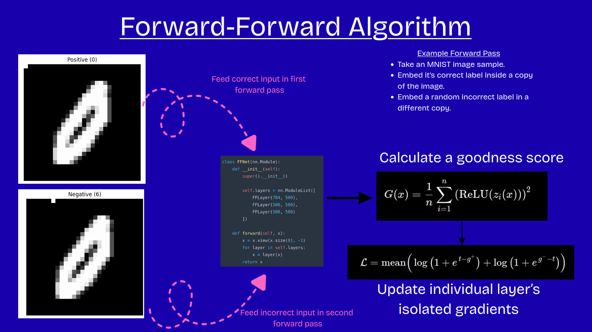
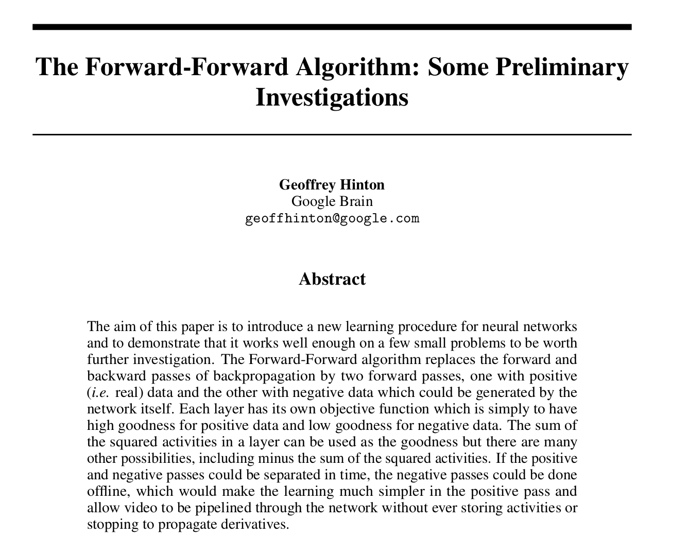

# Forward Forward Algorithm in Python Unofficial LeetArxiv Implementation
[Forward-Forward](https://leetarxiv.substack.com/p/forward-forward-algorithm-hinton) (Hinton, 2022) is a biologically-plausible backpropagation alternative that achieves ~96% (Löwe, 2023) accuracy on MNIST without flowing gradients.

It vastly outperforms [Target Propagation](https://leetarxiv.substack.com/p/target-propagation) (Bengio, 2014), another biologically plausible backprop alternative, that reaches ~39% accuracy on MNIST.

This is part of our Alternatives To Backpropagation series:
1. [Target Propagation: Autoencoders are great at reconstruction and can be used to learn backprop](https://leetarxiv.substack.com/p/target-propagation) 
2. [Belief Propagation: Training using Optimal Transport theory](https://leetarxiv.substack.com/p/sinkhorn-solves-sudoku) 
3. [Forward-Forward: We can train individual layers to discriminate data like GANs, and sum their correctness without backprop](https://leetarxiv.substack.com/p/forward-forward-algorithm-hinton) 

## Getting Started
We provide a Jupyter Notebook written to be followed alongside this [LeetArxiv guide](https://leetarxiv.substack.com/p/forward-forward-algorithm-hinton).
